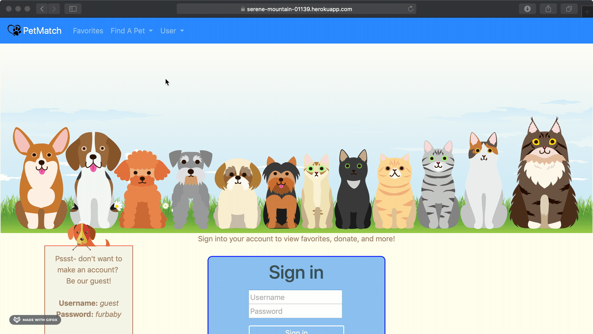

#### Purpose of the app:

This app was created to simplify the process of locating a pet for your family from the Houston, TX area. There are many shelters and rescues in this city, and we have aggregated all of the cats and dogs in the Houston area available for adoption.

#### How to use:

A user may view all available animals with or without creating an account. From the Home page, a user can navigate to either Dogs, Cats, or Both to display available animals. The user will then click on the photo of the desired animal, which will bring up the specific animal's details page. Pertinent information from the PetFinder database is displayed, including name, description, breed, age, gender, size, color, location and any special needs information.

#### Features on the app:

Utilizing the PetFinder API, both dogs and cats have a dedicated page displaying the 20 most recently-listed animals from local shelters.

- A user can login and access their account on the site.
- An account can be made securely as the password information is stored on the server as a hash string with bcrypt.
- A user can select Both to view the 20 most recently-listed cats and dogs in the Houston area together on one page.

Planned features for future development:

- Utilize the Favorites designator and assign a favorited animal to the user's account.
- Find My Match! filtering quiz that allows the user to narrow down animals based on search criteria relevant to their household composition and family needs.

## Site Preview

**Home Page:**
 

**Log-in screen:**
 

## Live Link

<a href="https://serene-mountain-01139.herokuapp.com/home" target="_blank">PetMatch App</a>

## GitHub Repo

<a href="https://github.com/MeerKatnip/PetMatch" target="_blank">PetMatch GitHub Repo</a>

## This site was built by:

- <a href="https://github.com/RickelleDawn" target="_blank">Rickelle Tackitt</a>
- <a href="https://github.com/hannahlima1991" target="_blank">Hannah Lima</a>
- <a href="https://github.com/WillisK-0" target="_blank">Keith Willis</a>
- <a href="https://github.com/MeerKatnip" target="_blank">Amy Roy</a>

## Database and API used:

- This project was built with <a href="https://aws.amazon.com/rds/" target="_blank">Amazon RDS</a> and deployed on <a href="https://www.heroku.com/" target="_blank">Heroku</a>
- The API used for this project is <a href="https://www.petfinder.com/developers/" target="_blank">PetFinder API</a>

## Language and Frameworks used:

JavaScript, PostgreSQL, Sequelize, Node.js, Mustache, Bootstrap, bcrypt, EXPRESS, HTML, CSS
